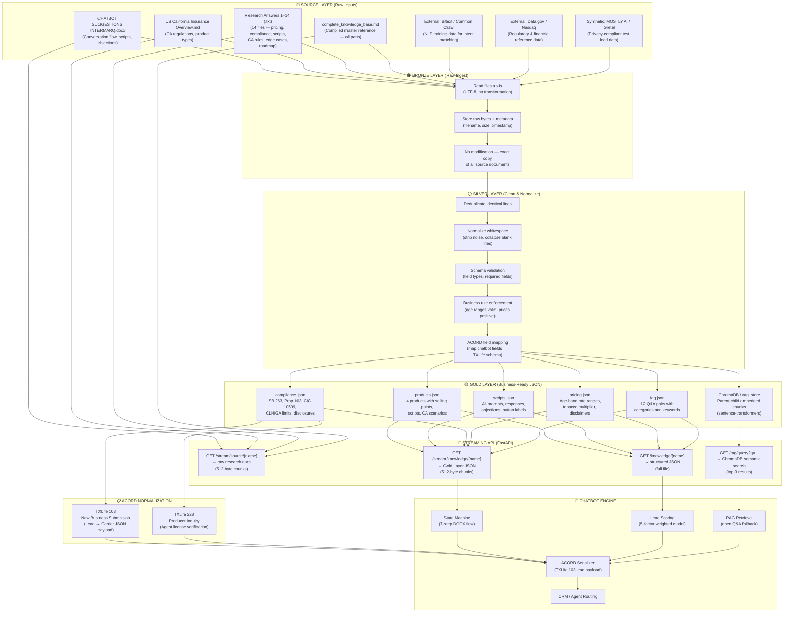
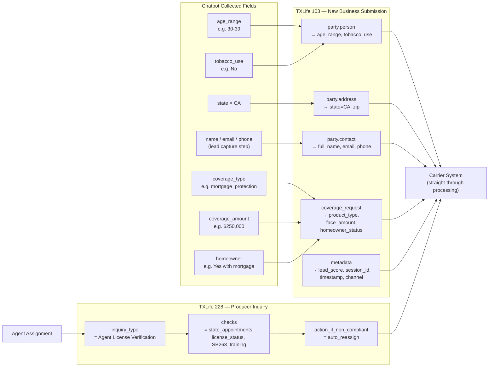
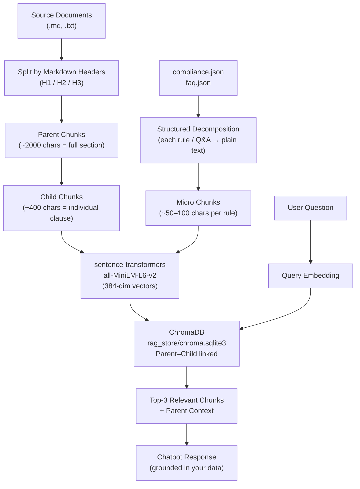

# Data Flow Diagram — California Insurance Chatbot

## Full Pipeline: Sources → Normalization → Chatbot

---

## ACORD Normalization Detail

---

## RAG Chunking Flow

---

## Summary Table

| Layer | Script | Input | Output |
|-------|--------|-------|--------|
| **Bronze** | *(implicit in 02)* | Raw files as-is | In-memory text |
| **Silver** | `02_data_pipeline.py` | Raw text | Cleaned, deduplicated text |
| **Gold** | `02_data_pipeline.py` | Silver text | `knowledge/*.json` (5 files) |
| **RAG** | `03_build_rag_index.py` | Gold JSON + source .md | `rag_store/chroma.sqlite3` |
| **ACORD** | `acord_normalizer.py` *(next)* | Chatbot lead fields | TXLife 103/228 JSON payload |
| **Stream** | `04_stream_server.py` | All Gold + Source | HTTP streaming API (port 8001) |
